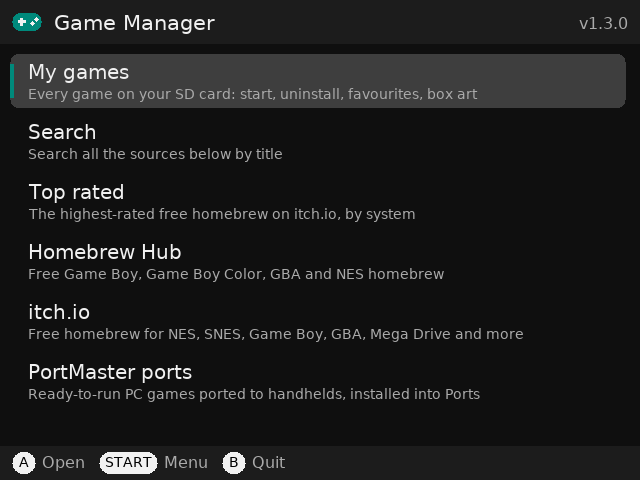
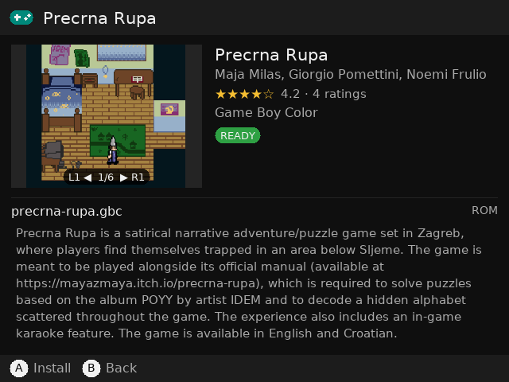
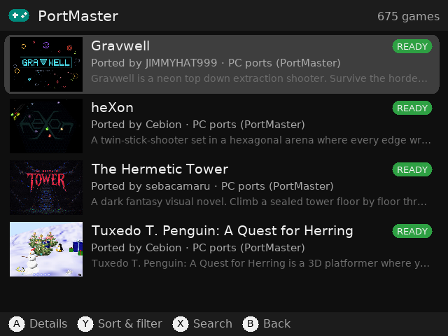
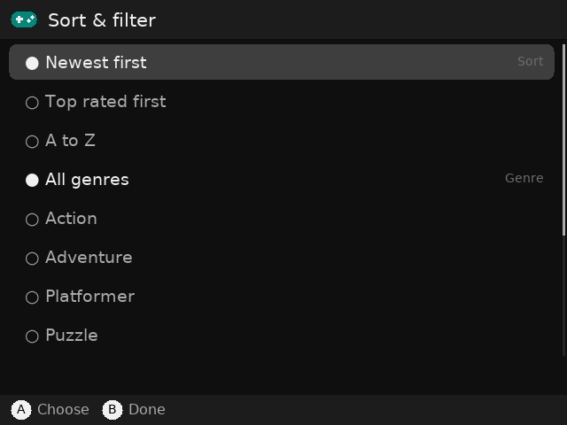

# Game Manager

**Find, download and install free homebrew games on muOS handhelds**, using the controller. Free and open source
([MIT License](LICENSE)). No account, no ads, no tracking.

| | |
|---|---|
|  |  |
|  |  |

- **Homebrew Hub** (hh3.gbdev.io): free Game Boy, Game Boy Color, GBA and NES homebrew games
- **itch.io**: free homebrew for NES, SNES, Game Boy, GBA, Mega Drive, Master System and Game Gear, plus your own itch.io library
- **PortMaster**: ~675 ready-to-run PC games ported to handhelds (only ports this device can run are shown), installed with PortMaster's own installer
- **Sort & filter** every list (newest, top rated, A–Z; Action, Puzzle, RPG…), a **Top rated** section, ratings and a **screenshot gallery** for each game
- Checks every game before and after downloading, so you know whether it will run
- Installs into the ROM folders muOS already uses, with box art and a description
- **Try it**: start a game straight from the app and mark whether it works
- **My games**: every game on your SD card(s), grouped by system (GBA, SNES, PS1, PSP, Dreamcast…), with box art, play time (from muOS), **Recently played** and **Favourites**. Start any game or uninstall it
- **Get box art for all games**: covers for your own ROMs too, from the libretro thumbnail library (the one RetroArch uses)
- **Uninstall**: removes the game's files, box art and description (your save files are kept)

## Guides

A step-by-step guide with pictures (finding games, installing, Try it, My games, box art):
[Install free homebrew games on muOS with Game Manager](https://pocketkode.com/blog/install-free-homebrew-games-muos-game-manager/)
on pocketkode.com.

## Tested on

| Device | Firmware |
|---|---|
| Anbernic RG40XXH | muOS 2601.0 Jacaranda |

Other muOS handhelds (especially the H700 family: RG35XX, RG40XXV, RG28XX…) should work too, but haven't been tested yet. Reports are welcome.

## Install

Download `GameManager-<version>.muxapp` from the [latest release](https://github.com/pocketkode/game-manager/releases/latest), copy it to the `ARCHIVE`
folder on SD card 1, then open **Applications → Archive Manager** and install it. Turn on **Wi-Fi**, then open
**Applications → Game Manager**.

## Will it run? How the app checks

| When | Check | Badge |
|---|---|---|
| In the list | Does this device have an emulator for the system? (read from muOS's own core list) | `READY` / `NO EMU` |
| In the list (itch.io) | Is there a console ROM among the downloads, or only PC/phone versions? | `ROM` / `CHECK` / `PC ONLY` |
| After downloading | The ROM header: is it a real ROM, which system is it really for, and does it need a particular core? | Shown when installing |
| After installing | **Try it** starts the game with muOS's launcher. If it closes within a few seconds, the app warns you. | `WORKS` / `DIDN'T RUN` in My games |

Examples of what the header check catches:

- A Game Boy game that only works on **Game Boy Color** goes in the GBC folder instead.
- Game Boy games with rare cartridge chips (MBC7, TAMA5, Pocket Camera) are set to use the **mGBA** core.
- NES games with unusual mappers are set to use **FCEUmm**, not QuickNES.
- SNES games with the **Super FX** or **SA-1** chips are set to use **Snes9x**.
- Master System and Game Gear games are sorted by the region code in their header.
- Text files, empty files and PC builds are rejected.

`CHECK` means the app couldn't tell from the file names alone. The header check still runs after downloading, and nothing is installed if the file isn't a ROM.

## How PortMaster ports install

Game Manager downloads the port, checks its MD5, then runs PortMaster's own `harbourmaster install`, so ports install exactly as they would from the PortMaster app. If that can't run, the zip is put in `PortMaster/autoinstall` and PortMaster finishes it the next time you open it. Log: `logs/portmaster.log`.

## itch.io API key

Browsing itch.io works without an account. **Downloading** needs your own free API key (the itch.io app works the same way):

1. On a computer, log in to itch.io and open <https://itch.io/user/settings/api-keys>.
2. Click **Generate new API key** and copy it.
3. Put it in `config.ini` (in the app folder) after `api_key =` (easiest, over SFTP or with a card reader), **or** type it on the console in **START → Settings → itch.io API key**.

With a key you also get **My itch.io library** (games you've claimed or bought) and itch.io results in **Search**.

## Controls

| Screen | Controls |
|---|---|
| Lists | A = open, B = back, START = settings (home screen) |
| Game list | A = details, Y = sort & filter, X = search, L1/R1 = jump 4, B = back |
| Game details | A = install / reinstall, Y = try it, X = uninstall, L1/R1 = screenshots, ◀ ▶ = pick another file, ▲ ▼ = scroll text |
| My games | A = open a shelf or system · then A = start, Y = favourite, X = uninstall, START = sort (A–Z, most played, recently played) |
| Keyboard | A = type, B = delete, Y = space, X = shift, L1 = clear, START = done, SELECT = cancel |

## Language

Game Manager comes in English, 日本語 (Japanese), Español, Français, Deutsch, Nederlands, Русский,
简体中文 (Simplified Chinese) and 한국어 (Korean). It follows muOS's language (**Configuration > Language**; any other
language means English). To change it, open **START → Settings → Language** and press **A** (Auto → English →
日本語 → … → 한국어); the choice is kept. Game titles and descriptions come from the game sites and stay as they are
there; the status badges (READY, NO EMU, INSTALLED…) stay in English. Japanese, Chinese and Korean text uses the Noto
Sans JP, SC and KR fonts (see [Third-party](#third-party)).

## Settings (`config.ini`)

The first start creates `config.ini` from `config.ini.example`; installing a new version never replaces it, so your
settings and API key stay.


- `roms_path`: where games go. Default `/mnt/mmc/ROMS` (SD card 1). SD card 2 is `/mnt/sdcard/ROMS`.
- `hide_pc_only`: hide itch.io games that only have PC or phone downloads (default `yes`).
- `include_demos`: also list demos from Homebrew Hub (default `no`).
- `swap_ab`: `yes` if A and B feel backwards.
- `api_key`: your itch.io API key.

## Where things go

| What | Where |
|---|---|
| Games | `ROMS/<system>/`, reusing an existing folder that muOS maps to that system (e.g. your `GBA` folder), otherwise `GB`, `GBC`, `GBA`, `NES`, `SNES`, `MD`, `SMS` or `GG` |
| Box art | `MUOS/info/catalogue/<system>/box/<game>.png` |
| Description | `MUOS/info/catalogue/<system>/text/<game>.txt` |
| Installed list | `data/installed.json` in the app folder |
| Logs | `logs/app.log`, `logs/tryit.log` |

## My games: how games are found

The app looks in `ROMS` on SD card 1 and SD card 2 and uses muOS's own folder-to-system table, so it sees the same systems muOS does. The Ports folder (PortMaster), media and books are left out.

- A **file** is one game. Files a game needs are grouped with it and deleted together: the `.bin` tracks of a `.cue`, the tracks of a `.gdi`, the discs of a `.m3u`, and the `.img`/`.sub` of a `.ccd`.
- A **folder** inside a system folder (e.g. `DC/Sonic Adventure (USA)/`) is one game. It's started from its main file (`.m3u`, `.cue`, `.gdi`, `.chd`, `.iso`… in that order), and uninstalling deletes the whole folder.
- Games start with the core you chose for them in muOS (per game or per folder), otherwise muOS's default, including standalone emulators like PPSSPP and Flycast.
- Play time comes from muOS's own tracker (`MUOS/info/track/playtime_data.json`), so it counts games started from the muOS menu.
- **Box art** is matched by name against the libretro thumbnail library, including older names like "Sky Blazer (E)" → "Skyblazer (Europe)". Homebrew and PSP minis usually aren't in that library.
- Uninstall never deletes anything outside a system folder, and never touches save files.

## Privacy

Game Manager never reads or sends your saves, screenshots or files, and doesn't track what you play.

For updates it reads the latest release on GitHub (you can turn this off in **START → Settings → Check for updates**).
It sends nothing about you or the handheld.

To list and download games it connects to **Homebrew Hub, itch.io, PortMaster (GitHub) and the libretro box-art library**;
your searches go to those sites, and your itch.io API key only to itch.io.

No ads, no analytics, no tracking.

## Updates

When the handheld is online, the app reads `update.json` from this repository's latest release (at start and once a
day) and shows **Update available** with what's new. Nothing is installed unless you choose **Update**. The download
is checked (its SHA-256 and PocketKode's Ed25519 signature, public key in `gamemanager/updater.py`) before anything
changes, and the new version is installed when the app restarts (**Restart now**); your games and settings stay. If an
updated version doesn't start, the app goes back to the previous one by itself.

## Troubleshooting

- **"No internet connection":** turn on Wi-Fi in muOS (Configuration → Network).
- **"Secure connection failed":** the device's date and time are wrong. Fix them in muOS settings.
- **A new game doesn't appear:** go back to the muOS main menu and open the system again. New folders (e.g. `GB`) are picked up automatically.
- **Try it closes straight away:** see `logs/tryit.log`. In muOS you can pick another core for the game (select the game → Core).

## Building

Needs bash, curl, unzip, zip and Python 3 (macOS or Linux).

```sh
git clone https://github.com/pocketkode/game-manager.git
cd game-manager
./build.sh
```

This makes `dist/GameManager.muxapp`, the package you install with Archive Manager. The app is plain Python 3 and uses
the Python, SDL2, SDL2_ttf and SDL2_image that come with muOS; the build adds PySDL2 and the fonts (downloaded once;
the Noto fonts are checked against their SHA-256). `dist/stage/GameManager/` holds the same files unpacked.

## Running

- **On the handheld:** copy `dist/GameManager.muxapp` to `ARCHIVE` on SD card 1 and install it with **Applications →
  Archive Manager** (close the app first). To try a change quickly, copy the changed files over the installed app in
  `MUOS/application/GameManager/` on SD card 1 (for example with muOS's SFTP: **Configuration → Web Services**) and start
  it again. Logs: `logs/app.log` and `logs/tryit.log` in the app folder.

### On a computer

With PySDL2 and SDL2 installed, `GM_TEST_ROOT=/path/to/fake-sd GM_WINDOWED=1 python3 main.py` runs the app against a fake SD card containing `share/` (a copy of `/opt/muos/share/info` and `share/core`), `ROMS/` and `catalogue/`. Keyboard: arrows, Enter = A, Esc = B, x, y, q/e = L1/R1, s = START.


A build of your own can't install PocketKode's updates over itself unless it's signed with PocketKode's key, so for a
fork change `REPO` and `UPDATE_KEY` in `gamemanager/updater.py`, or turn updates off in Settings.

## Project layout

The app folder follows the layout of muOS's own applications:

| Path | What it is |
|---|---|
| `mux_launch.sh` | The launcher muOS runs (its `HELP`, `ICON` and `GRID` lines name the app) |
| `mux_lang.ini` | The app's name and help text in the muOS languages |
| `glyph/` | The app icon |
| `main.py` | Starts the app (and finishes a downloaded update first) |
| `config.ini.example` | The default settings, copied to `config.ini` on the first start |
| `gamemanager/` | The app itself: screens (`app.py`), sources (`sources.py`, `sources_extra.py`), installing (`installer.py`, `romcheck.py`), My games (`mygames.py`, `romscan.py`, `boxart.py`), muOS systems and cores (`systems.py`, `launcher.py`), drawing and input (`ui.py`, `art.py`, `input.py`), updates (`updater.py`) |
| `lang/` | Translations, one JSON file per language |
| `deps/`, `fonts/`, `licenses/` | PySDL2, the fonts and their licences (added by `build.sh`) |
| `data/`, `logs/` | Made on the handheld: your installed games list, favourites and the logs |

## Contributing

Bug reports, new game sources, translations and pull requests are welcome: open an [issue](https://github.com/pocketkode/game-manager/issues), or email
**feedback@pocketkode.com**.

- Every text shown on screen is wrapped in `_("English text")` in the code. The translations are in
  `lang/<code>.json` (`ja`, `es`, `fr`, `de`, `nl`, `ru`, `zh`, `ko`): `"texts"` maps each English text to its
  translation, and `"patterns"` translates messages with a number or name in them. Keep the `{placeholders}` as they
  are. A text that isn't translated shows in English; `./build.sh` lists them.
- Please test on a handheld before sending a pull request, and say which device and muOS version you used.
- Only free games, as the sources list them. The app never re-hosts games.

## Third-party

- **PySDL2** ([py-sdl2](https://github.com/py-sdl/py-sdl2)), © Marcus von Appen, CC0 or zlib: bundled unmodified in
  `deps/sdl2/` (licence in `licenses/`).
- **DejaVu Sans** ([dejavu-fonts](https://dejavu-fonts.github.io/)), Bitstream Vera Fonts license: `fonts/`.
- **Noto Sans JP, SC and KR** ([noto-cjk](https://github.com/notofonts/noto-cjk)), © Adobe and Google, SIL Open Font
  License 1.1: `fonts/`, licences in `licenses/`.
- Game listings and files come from [Homebrew Hub](https://hh3.gbdev.io) (the gbdev community), [itch.io](https://itch.io)
  and [PortMaster](https://portmaster.games), and box art from the [libretro thumbnail library](https://thumbnails.libretro.com),
  fetched on your handheld when you ask. Games belong to their creators and come with their own licenses. Game Manager
  is an independent project, not affiliated with or endorsed by any of them, muOS or Anbernic.

## License

[MIT](LICENSE) © 2026 PocketKode
